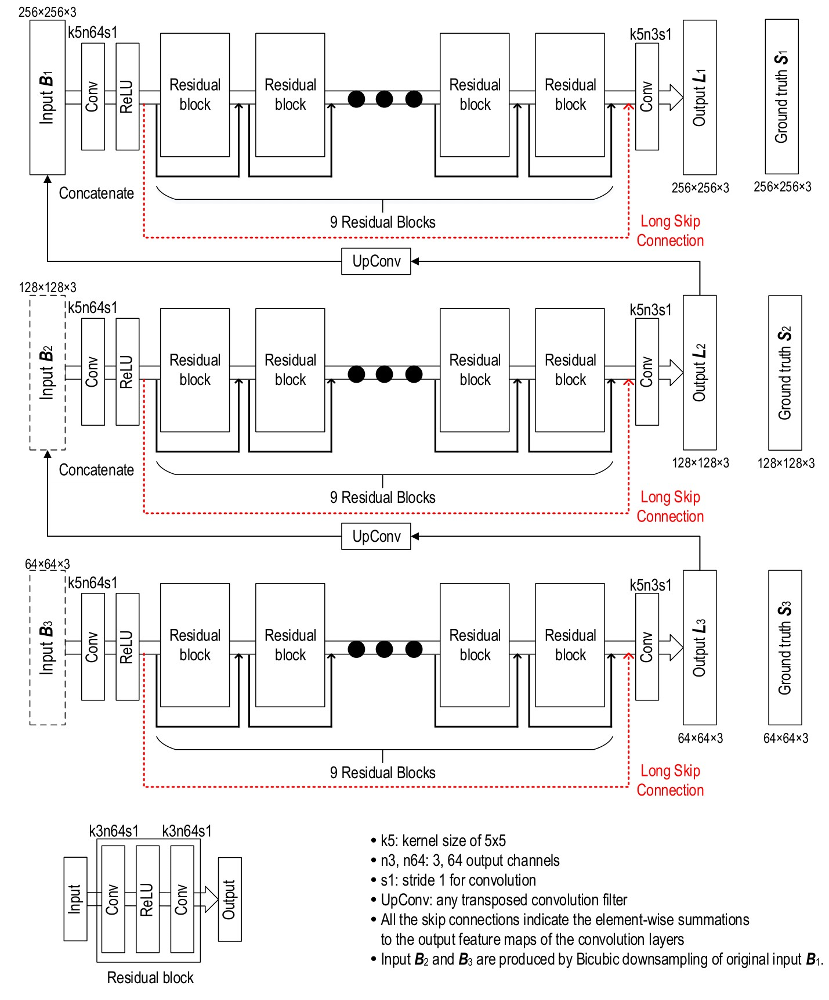
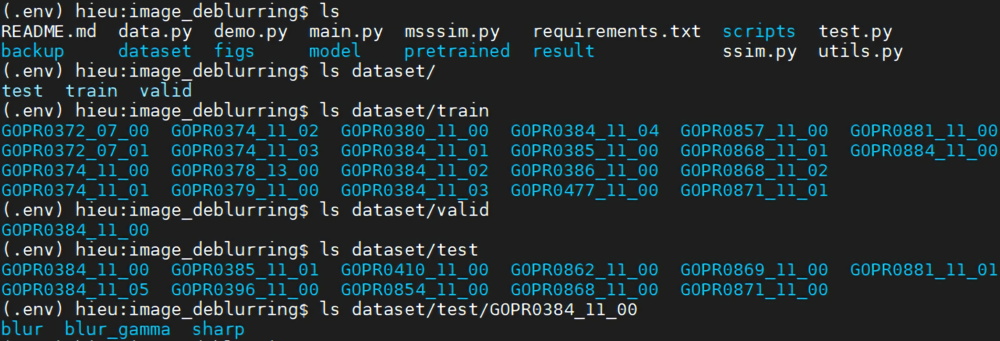
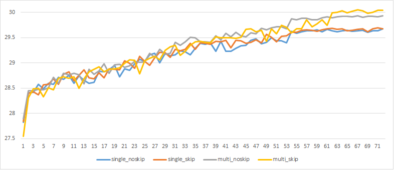

# Multi-scale architecture for image deblurring

This project is to implement a multi-scale architecture for image deblurring.




 To run this project you need to setup the environment, download the dataset,  and then you can train and test the network models. I will show you step by step to run this project and I hope it is clear enough. 

## Prerequisite

The project is tested on Ubuntu 16.04, GPU Titan XP. Note that one GPU is required to run the code. Otherwise, you have to modify code a little bit for using CPU. If  using CPU for training, it may too slow.   So I recommend you using GPU strong enough and about 12G RAM. 

## Dependencies

Python 3.5 or 3.6 are recommended.
```
tqdm==4.19.9
numpy==1.17.3
tensorflow==1.9.0
tensorboardX==1.9
torch==1.0.0
Pillow==6.1.0
torchvision==0.2.2
```

## Environment

I recommend using ```virtualenv``` for making an environment. If you using ```virtualenv```, run the following commands in the root folder.

```
virtualenv -p python3 .env
source .env/bin/activate
pip install -r requirements.txt
```

## Dataset

I use GOPRO dataset for training and testing. __Download links__:  [GOPRO_Large](https://drive.google.com/file/d/1H0PIXvJH4c40pk7ou6nAwoxuR4Qh_Sa2/view?usp=sharing)

| Statistics  | Training | Test | Total |
| ----------- | -------- | ---- | ----- |
| sequences   | 22       | 11   | 33    |
| image pairs | 2103     | 1111 | 3214  |

After downloading dataset successfully, you need to put images in right folders. By default, you should have images on dataset/train and dataset/valid folders.



If you change where stores dataset, it requires to change .sh files in scripts folder.
You may find that 'ln -s' command is useful for preparing data.

## Demo

I provide pretrained models in pretrained folder. You can generate deblurred images by running the following command:

```
sh scripts/demo.sh
```
The above command may be failed due to the difference of line separator between Window and Ubuntu. You may have to use a direct command:
```
python demo.py --gpu 0 --train_dir pretrained --exp_name multi_skip --image "dataset/test/GOPR0384_11_00/blur/000001.png" "dataset/test/GOPR0384_11_05/blur/004001.png" "dataset/test/GOPR0385_11_01/blur/003011.png"
```
After ```--image``` you can put one or more image paths.

For using other models, you should uncommend lines in scripts/demo.sh file.

## Training

Run the following command

```
sh scripts/train.sh
```
For training other models, you should uncommend lines in scripts/train.sh file.

I used ADAM optimizer with a mini-batch size 16 for training. The learning rate is 1e-4. Total training takes 600 epochs to converge.  To prevent our network from overfitting, several data augmentation techniques are involved. In terms of geometric transformations, patches are randomly rotated by 90, 180, and 270 degrees. To take image degradations into account, saturation in HSV colorspace is multiplied by a random number within [0.8, 1.2].   



## Testing

Run the following command

```
sh scripts/test.sh
```
For testing other models, you should uncommend lines in scripts/test.sh file.

|                 |      PSNR   |     SSIM   |   MSSIM    |
| -----------     | --------    |   -----    |   -----    |
|    __SSN__      | 27.20       |    0.8256  |   0.9069   |
|    __SSNL__     | 27.25       |    0.8275  |   0.9083   |
|    __MSN__      | 27.56       |    0.8362  |   0.9149   |
|    __MSNL__     | __27.64__   | __0.8373__ | __0.9150__ |

__SSN__: Single-Scale Network without long-skip connection 

__SSNL__: Single-Scale Network with long-skip connection 

__MSN__: Multi-Scale Network without long-skip connection 

__MSNL__: Multi-Scale Network with long-skip connection 
## References

Deep Multi-scale Convolutional Neural Network for Dynamic Scene Deblurring [[paper](http://openaccess.thecvf.com/content_cvpr_2017/papers/Nah_Deep_Multi-Scale_Convolutional_CVPR_2017_paper.pdf)]

